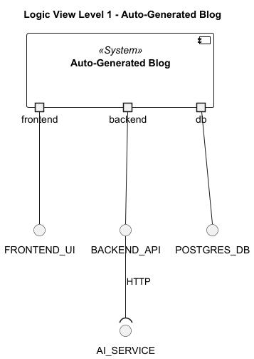
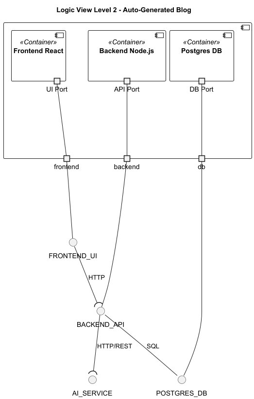
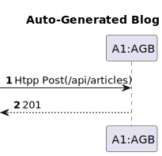
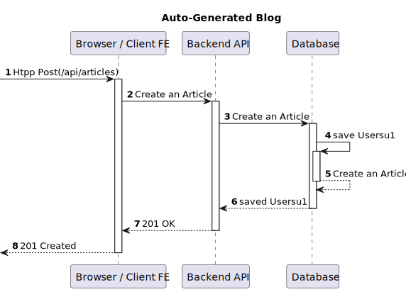

# Solution Architecture – Auto-Generated Blog (AWS + Docker)

## DM

>Central entity: `Article`  
>Main fields:
>- id, title, text, date
>>Persistence in PostgreSQL 

## UCD

>Main actors and functionalities:
>>- Anonymous user: view article list and full article content
>>- Anonymous user: manually trigger generation of a new AI article
>>- System (automated): generate 1 new article per day via AI

## Logical View

#### Logical View N1

>High-level layered architecture of the Auto-Generated Blog solution.

#### Logical View N2

>Detailed layered architecture:
>>- Frontend: React
>>- Backend: Node.js
>>- Persistence: PostgreSQL
>>- External Service: HuggingFace Inference API
## Physical View

#### Physical View Level 2
 

> Current deployment 1x EC2  (free-tier)
>>   - `frontend` → React static build  
>>   - `backend` → Node.js + PostgreSQL client
>>   - `db` → Postgres 15

# Process View

>The Process Views present the dynamic behavior of the Auto-Generated Blog solution, showing how system components interact during the execution of each use case.

### Process View – Level 1 (VPN1)

### Process View – Level 2 (VPN2)

>This level provides a high-level representation of how any interaction flows through the system.
It abstracts away internal details and focuses on the generic request/response cycle:
>>A client (browser or automated scheduler) sends a request to the Backend.
>>The Backend processes the request, performs business logic, and accesses the Database if needed.
>>A response is sent back to the client.

