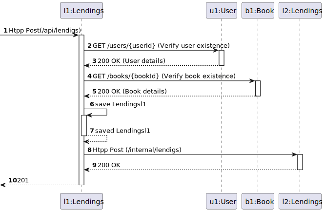
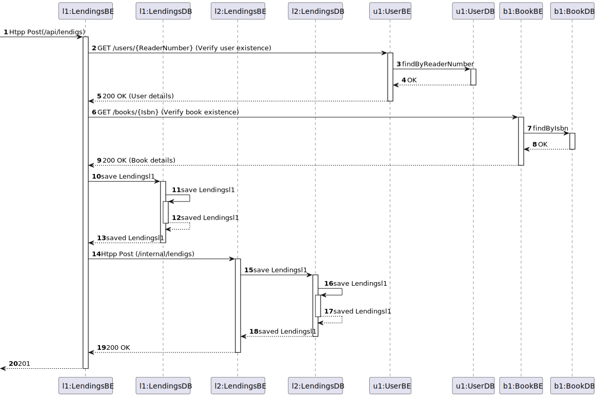
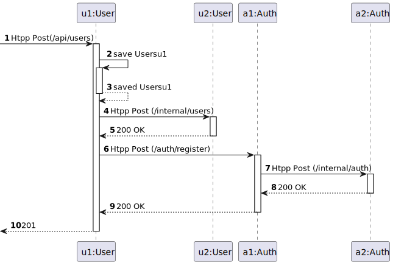
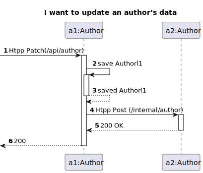
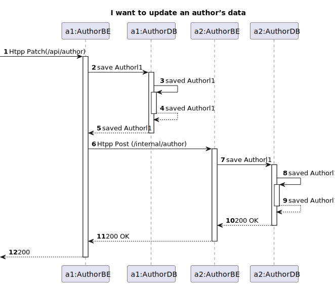

# Arquitetura da Solução – Auto-Generated Blog (AWS + Docker)

## DM

>Central entity: `Article`  
>Main fields:
>- id, title, text, date
>>Persistence in PostgreSQL 

## UCD

>Main actors and functionalities:
>>- Anonymous user: view article list and full article content
>>- Anonymous user: manually trigger generation of a new AI article
>>- System (automated): generate 1 new article per day via AI

## Vista Lógica

#### Vista Lógica N1

>High-level layered architecture of the Auto-Generated Blog solution.

#### Vista Lógica N2

>Detailed layered architecture:
>>- Frontend: React
>>- Backend: Node.js
>>- Persistence: PostgreSQL
>>- External Service: HuggingFace Inference API
## Vista Fisica

#### Vista Fisica N2
 

> Current deployment 1x EC2  (free-tier)
>>   - `frontend` → React static build  
>>   - `backend` → Node.js + PostgreSQL client
>>   - `db` → Postgres 15

# Vista de Processo
### Vista de Processo de Nivel 1

>Sendo que todas as Vista  de processo serao semelhantes a esta so a representamos uma vez 

### Vista de Processo de Nivel 2
##### Vista de Processo de Nivel 2 US15

>Vista de Processo de nivel 2 da User Story 015 "As a Librarian i want to lend a book to a reader."

######  Vistas de Processo NV3 da US15

>Vista de Processo de nivel 3 da User Story 015 "As a Librarian i want to lend a book to a reader."

##### Vista de Processo de Nivel 2 US011

>Vista de Processo de nivel 2 da User Story 011 "As a Anonymous i want to register as a reader."

##### Vistas de Processo US04

>User Story 04 "As a Librarian I want to update an author’s data."

######  Vistas de Processo NV2 da US04

######  Vistas de Processo NV3 da US04

